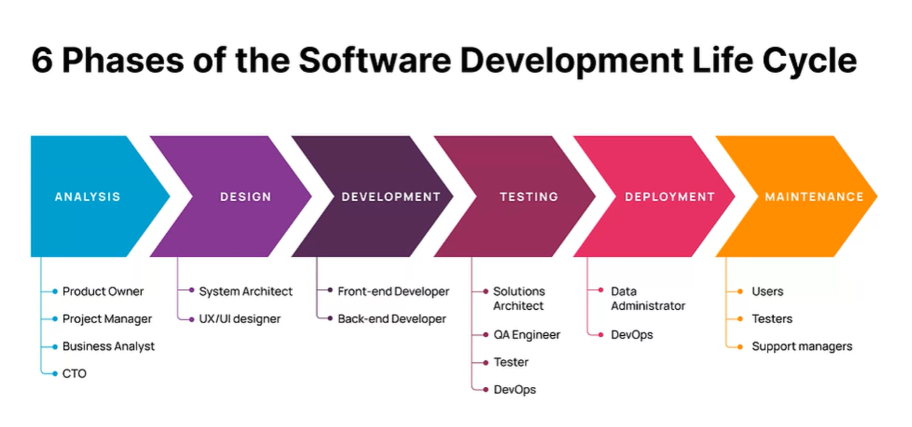
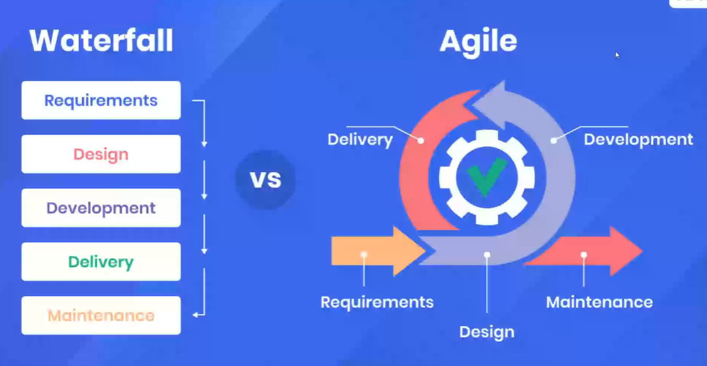
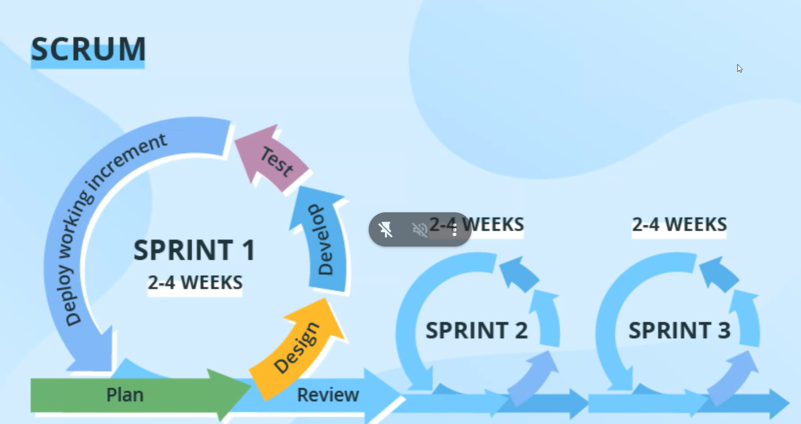
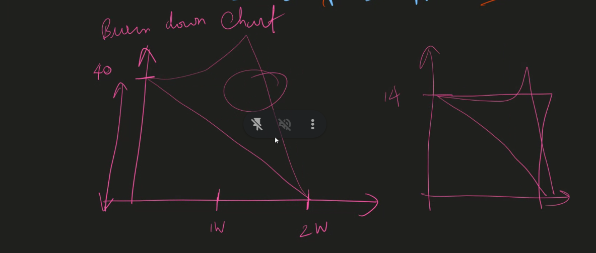
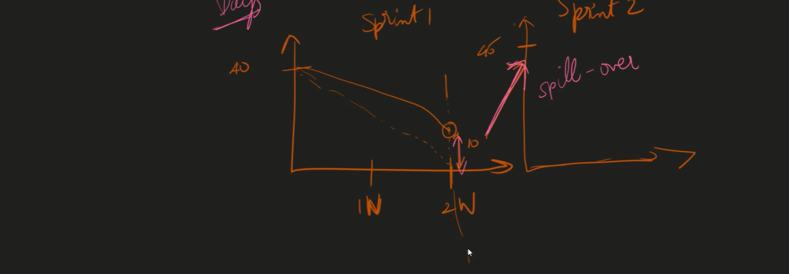

# June 03

## The Software Development Lifecycle

[SDLC Image](https://miro.medium.com/v2/resize:fit:2500/format:webp/0*qZ1JOnVpPokvnr69.jpg)

- Designing should be done before coding starts
- designing make the _prototype_
- [Figma website](https://www.figma.com/) is used to design the applications
- [Color website](https://coolors.co/) is used to choose color combinations

### Layout

- where the components should be placed

### Stakeholders

- Are the _Investors_ on the products
- Stakeholders are responsible for anything goes wrong in the product in terms of taking risks



- _System Architect_ will decide which technology should we use in the project, Which technology will be fit for the project.
- _System Architect_ also know the coding

## Product vs Service based Company

### Service Based

- Only one time use
- For a particular use

### Product Based

- Multiple users
- Long term
- B2B

### Waterfall and Agile Methodologies



### Scrum



- **Scrum** is a implementation of agile
- 1 sprint is of _2 weeks_
- Sprint planning _1 Hour_
- breaking into small chunks and assign to developers
- Standup Call is of _10-15 minutes_, it is about what happened yesterday what will you do today
- After 14th day review meeting and retrospective (1hr) will happen

### Burn Down Chart




## Coding Standards

Are meant have uniformity thoughout your code base

### Code quality

### Dry

### Variable name

- Understandable / Descriptive

```js
let a = 50; //❌
let age = 50; //✅
```

- camelCase

```js
let student_name = "Nithin"; //❌
let studentName = "Nithin"; //✅
```

### Errors

- Reserved keywords (if,for)

```js
let if = "Nithin"; //❌
```

- Cannot start with numbers

```js
let 2student_name = "Nithin"; //❌
let studentName2 = "Nithin"; //✅
```

- Cannot start with symbols (except for '\_')

```js
let student$name = "Nithin"; //❌
let student_Name = "Nithin"; //✅
```

- choose `let` over `var`, `const` over `let`

```js
let panCard = "KQTPK3551B"; //❌
CONST panCard = "KQTPK3551B"; //✅
```

- Write your const const case

```js
CONST piValue = 3.14; //❌
CONST PI_VALUE = 3.14; //✅
```

## Documentation

- Single line comment

```js
//
```

- Multiple line comments

```js
/**
 * This is cool
 * function
 *
 * /
```

```js
/**
 * Converts the string to uppercase.
 * @param {string} str - The string.
 * @returns {string} The upper case String.
 */
function changeToUpper(str) {
  return str.toUpperCase();
}

// Write a function to make it uppercase
console.log(changeToUpper("proclink"));
```

- To enforce coding standards use [Eslint](https://eslint.org/) package
