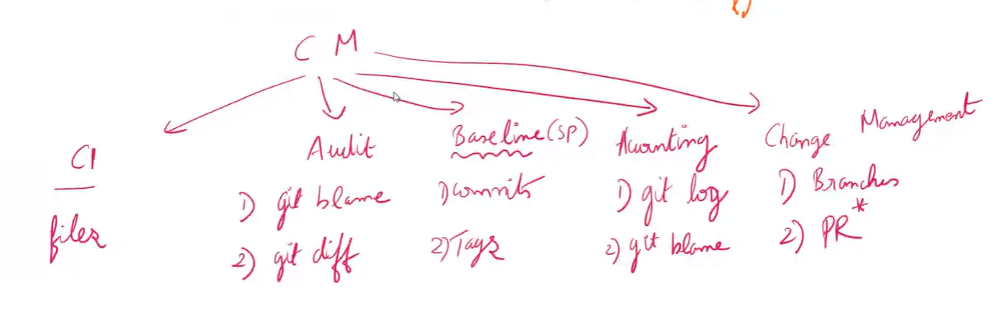
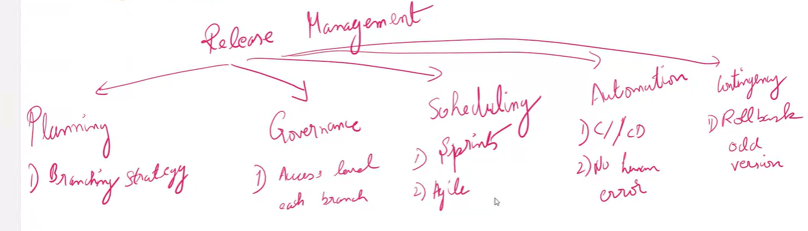
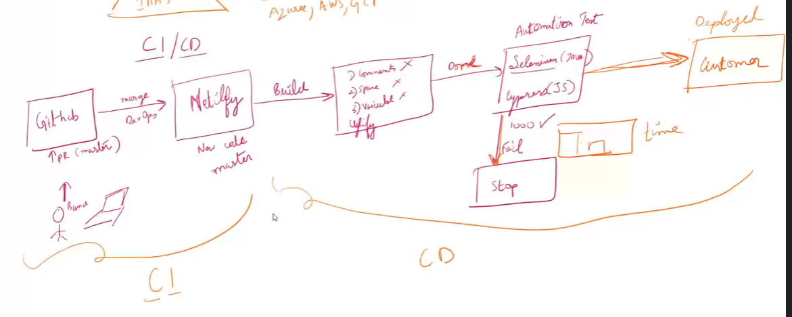

# 6th June

- git pull --rebase origin dev // is the first cmd to run first when you are in feature branch
- delete the branch locally // git branch -D

## KEY TERMS

- git is a **Configuration management**
- CI - Configuration Item -> Git files
- Release management (Related to Configuration management) -> Branching strategy -> master,staging,dev
- CI/CD - Continuous Integration/ Continuous Deploy -> _Netlify_

## Configuration Management

#### Benefits of CM

1. Traceability - who? why?
2. Quality & Consistency
3. Reduces risks and avoid errors
4. Change Management

## Release Management

## CI/CD

# HTML

[Emmet cheatsheet](https://docs.emmet.io/cheat-sheet/)

ol>li\*4 // (Emmet)

# css

### Text styling - I

- font-size
- font-weight
- font-style
- color

### Text styling - II

- text-transform
- text-align
- text-decoration
- letter-spacing
- line-height
