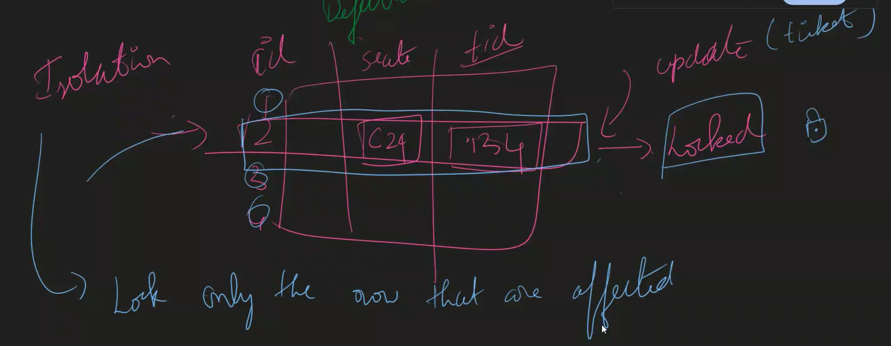
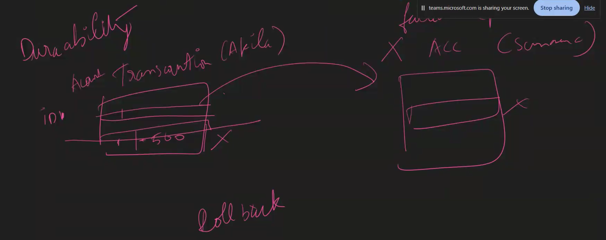

# 24TH jUNE

- refer views.sql
- Procedures

> Indexing

1. Clustered -> (Primary key) (decides table order) , (only one per table)
2. Un Clustered -> (non pk), (not decides table order), (Many per table)

> ACID Properties

### Atomicity

- A transaction should be completed fully or failed fully but not Partially

### Consistency

### Isolation

### Durability

