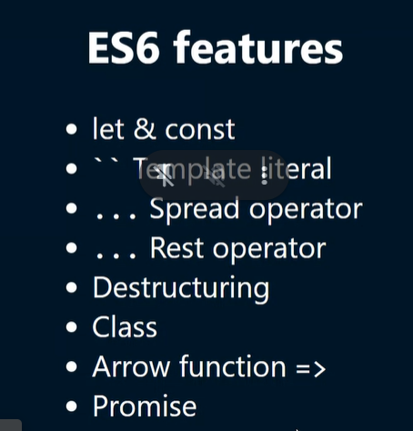

# 31st May

### ES6 Features

##### let and const

##### `` Template literal

1. ```js
   function fullname(firstname, lastname) {
     return `welcome ${lastname}, ${firstname} 😊!!!`;
   }
   ```
2. ```js
   const quote = `Dream is not that you see in sleep,
   dream is something
   that does not let you sleep`;
   ```

##### ... Spread operator

##### ... Rest operator

-

### Object methods

```js
let salaries = {
  john: 100,
  pete: 200,
  mary: 300,
};
Object.keys(salaries);
Object.values(salaries);
```

- Refactor -> Quality better & functionality same

```js
// Refactor -> Quality better & functionality same

const movieUrl1 = (domain, genre, year) => {
  return `http://${domain}?genere=${genre}&year=${year}`;
};

console.log(movieUrl1("imdb.com", "thriller", 2020));
```

### Array destructing

```js
const [t1, t2, t3 = 80] = [100, 200, 500];
console.log(t1, t2, t3); // 100 200 500

const [s1, s2, s3 = 80] = [100, 200, null];
console.log(s1, s2, s3); // 100 200 null

const [q1, q2, q3 = 80] = [100, 200, undefined];
console.log(q1, q2, q3); /// 100 200 80

const [, r1, r2, r3 = 80] = [100, 200, null]; //HOLES
console.log(r1, r2, r3); // 200 null 80
```

### Object destructing

```js
const avenger = {
  name: "Tony stark",
  house: "🏘️",
  networth: "💰",
  power: "🤖",
  phrase: "💗 you 300",
};
console.log(avenger.name);
console.log(avenger.house);
console.log(avenger.power);

const { name, networth, power } = {
  name: "Tony stark",
  house: "🏘️",
  networth: "💰",
  power: "🤖",
  phrase: "💗 you 300",
};
console.log(name, power);

const {
  name,
  networth,
  power,
  skill = ["genius", "milliniour"],
} = {
  name: "Tony stark",
  house: "🏘️",
  networth: "💰",
  power: "🤖",
  phrase: "💗 you 300",
};
console.log(name, power, skill);
```



## Binary operators

- Arithmetic +,-,\*,/
- Logical &&,||,
- Relational >,<,>=,=,==,!=

## Unary operator

- ++,--,!

## Truthy vs Falsy
- if value converts into *true* it is truthy and viceversa

```js
let x = "cool";
if (x) {
  console.log("hey"); // output
} else {
  console.log("hello");
}

let x = 0;
if (x) {
  console.log("hey");
} else {
  console.log("hello"); // output
}
```
- [falsy table](https://developer.mozilla.org/en-US/docs/Glossary/Falsy)
- if ...var in right side it is SPREAD else REST

- uppercase -> .toUpperCase()
- Lowercase -> .toLowerCase()
- "This is a book".split(" ") -> ['This','is','a','book']
- "This is a book".split("") -> ['T','h','i',......]
- ['This','is','a','book'].join("|")   -> 'This|is|a|book'
