# Banking System

> 1. Insert at least 10 sample records into each of the following tables: `Customers`, `Accounts`, `Transactions`, `InterestRates`, `Branches`.

> Customer Table

```sql
INSERT INTO Customers (customer_id, first_name, last_name, DOB, email, phone_number, address)
VALUES
  (1, 'John', 'Doe', '1985-05-15', 'john.doe@example.com', '555-1234', '123 Main St, Anytown USA'),
  (2, 'Jane', 'Smith', '1990-09-20', 'jane.smith@example.com', '555-5678', '456 Oak Rd, Anytown USA'),
  (3, 'Michael', 'Johnson', '1978-03-01', 'michael.johnson@example.com', '555-9012', '789 Elm St, Anytown USA'),
  (4, 'Emily', 'Davis', '1992-11-12', 'emily.davis@example.com', '555-3456', '321 Pine Ave, Anytown USA'),
  (5, 'David', 'Wilson', '1982-07-25', 'david.wilson@example.com', '555-7890', '654 Oak Ln, Anytown USA'),
  (6, 'Sarah', 'Anderson', '1995-04-08', 'sarah.anderson@example.com', '555-2109', '987 Maple Rd, Anytown USA'),
  (7, 'Robert', 'Thompson', '1988-12-03', 'robert.thompson@example.com', '555-6543', '159 Birch St, Anytown USA'),
  (8, 'Jessica', 'Martinez', '1991-06-18', 'jessica.martinez@example.com', '555-0987', '753 Willow Ln, Anytown USA'),
  (9, 'Christopher', 'Hernandez', '1980-02-14', 'christopher.hernandez@example.com', '555-4321', '951 Cedar Ave, Anytown USA'),
  (10, 'Olivia', 'Gonzalez', '1993-08-27', 'olivia.gonzalez@example.com', '555-8765', '357 Maple St, Anytown USA');
```

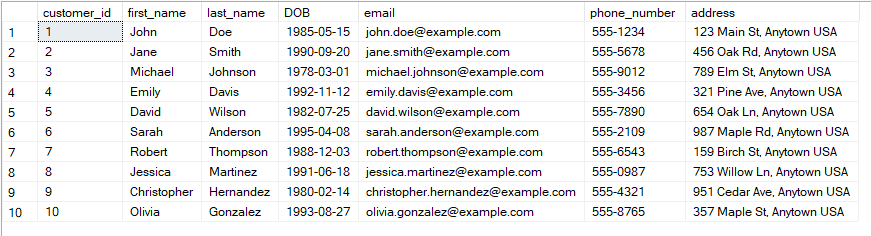

> Accounts Table

```sql
INSERT INTO Accounts (account_id, customer_id, account_type, balance)
VALUES
  (1, 1, 'savings', 5000.00),
  (2, 1, 'current', 10000.00),
  (3, 2, 'savings', 8000.00),
  (4, 2, 'current', 15000.00),
  (5, 3, 'savings', 3000.00),
  (6, 3, 'current', 20000.00),
  (7, 4, 'savings', 6500.00),
  (8, 4, 'current', 12000.00),
  (9, 5, 'savings', 4000.00),
  (10, 5, 'current', 18000.00);
```

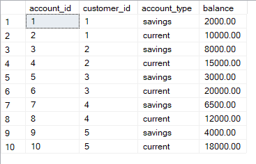

> Transactions Table

```sql
  INSERT INTO Transactions (transaction_id, account_id, transaction_type, amount, transaction_date)
VALUES
  (1, 1, 'deposit', 1000.00, '2023-01-01'),
  (2, 1, 'withdrawal', 500.00, '2023-01-15'),
  (3, 2, 'transfer', 2000.00, '2023-02-01'),
  (4, 3, 'deposit', 3000.00, '2023-03-01'),
  (5, 3, 'withdrawal', 1000.00, '2023-03-15'),
  (6, 4, 'transfer', 5000.00, '2023-04-01'),
  (7, 5, 'deposit', 2000.00, '2023-05-01'),
  (8, 5, 'withdrawal', 1000.00, '2023-05-15'),
  (9, 6, 'transfer', 4000.00, '2023-06-01'),
  (10, 7, 'deposit', 1500.00, '2023-07-01');
```


> InterestRates Table

```sql
  INSERT INTO InterestRates (interest_rate_id, account_type, interest_rate)
VALUES
  (1, 'savings', 0.05),
  (2, 'current', 0.02);
```

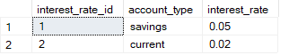

> Branches Table

```sql
  INSERT INTO Branches (branch_id, branch_name, address)
VALUES
  (1, 'Main Branch', '123 Main St, Anytown USA'),
  (2, 'Downtown Branch', '456 Oak Rd, Anytown USA'),
  (3, 'Uptown Branch', '789 Elm St, Anytown USA'),
  (4, 'Westside Branch', '321 Pine Ave, Anytown USA'),
  (5, 'Eastside Branch', '654 Oak Ln, Anytown USA');
```

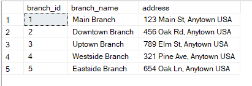

> 2. Write a SQL query to retrieve the name, account type, and email of all customers.

```sql
SELECT
c.first_name,
c.last_name,
a.account_type,
c.email
FROM Customers c
JOIN Accounts a ON c.customer_id = a.customer_id;
```


> 3. Write a SQL query to list all transactions along with the corresponding customer.

```sql
SELECT
  t.transaction_id,
  t.account_id,
  t.transaction_type,
  t.amount,
  t.transaction_date,
  c.first_name,
  c.last_name
FROM Transactions t
JOIN Accounts a ON t.account_id = a.account_id
JOIN Customers c ON a.customer_id = c.customer_id;
```

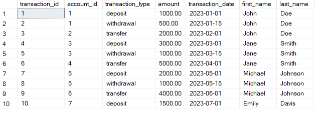

> 4. Write a SQL query to increase the balance of a specific account by a certain amount.

```sql
UPDATE Accounts
SET balance = balance + 1000.00
WHERE account_id = 1;
```

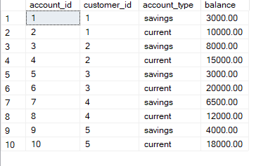

> 5. Write a SQL query to combine the first and last names of customers as `full_name`.

```sql
SELECT
  CONCAT(first_name, ' ', last_name) AS full_name
FROM Customers;
```

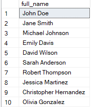

> 6. Write a SQL query to remove accounts with a balance of zero where the account type is savings.

```sql
DELETE FROM Accounts
WHERE account_type = 'savings' AND balance = 0;
```

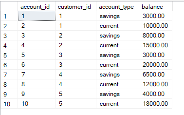

> 7. Write a SQL query to find customers living in a specific city.

```sql
SELECT *
FROM Customers
WHERE address LIKE '%Anytown USA%';
```

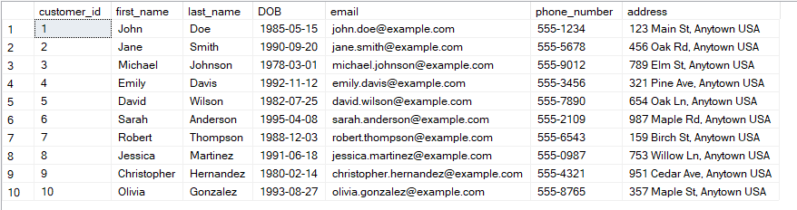

> 8. Write a SQL query to get the account balance for a specific account.

```sql
SELECT balance
FROM Accounts
WHERE account_id = 6;
```

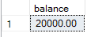

> 9. Write a SQL query to calculate the interest accrued on savings accounts based on a given interest rate.

```sql
SELECT
  a.account_id,
  a.balance,
  i.interest_rate,
  a.balance * i.interest_rate AS interest_accrued
FROM Accounts a
JOIN InterestRates i ON a.account_type = i.account_type
WHERE a.account_type = 'savings';
```

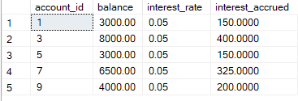

> 10. Write a SQL query to find the average account balance for all customers.

```sql

SELECT AVG(balance) AS average_balance
FROM Accounts;

```

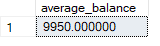

> 11. Write a SQL query to calculate the average daily balance for each account over a specified period.

```sql
SELECT
  a.account_id,
  AVG(t.amount) AS average_daily_balance
FROM Accounts a
JOIN Transactions t ON a.account_id = t.account_id
WHERE t.transaction_date BETWEEN '2023-01-01' AND '2023-12-31'
GROUP BY a.account_id;
```

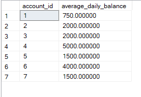

> 12. Identify accounts with the highest number of transactions ordered by descending order.

```sql
SELECT
  a.account_id,
  COUNT(t.transaction_id) AS num_transactions
FROM Accounts a
JOIN Transactions t ON a.account_id = t.account_id
GROUP BY a.account_id
ORDER BY num_transactions DESC;
```

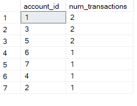

> 13. List customers with high aggregate account balances, along with their account types.

```sql
SELECT c.customer_id, a.account_type, SUM(a.balance) AS total_balance
FROM Customers c
JOIN Accounts a ON c.customer_id = a.customer_id
GROUP BY c.customer_id, a.account_type
HAVING SUM(a.balance) > 10000;
```

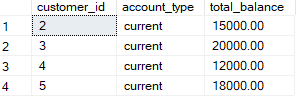

> 14. Identify and list duplicate transactions based on transaction amount, date, and account.

```sql
SELECT transaction_id, account_id, amount, transaction_date, COUNT(*) AS duplicate_count
FROM Transactions
GROUP BY transaction_id,account_id, amount, transaction_date
HAVING COUNT(*) > 1;
```


> 15. Calculate the total balance for each account type, including a subquery within the SELECT clause.

```sql
SELECT
  account_type,
  (SELECT SUM(balance) FROM Accounts WHERE account_type = a.account_type) AS total_balance
FROM Accounts a
GROUP BY account_type;
```

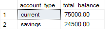
